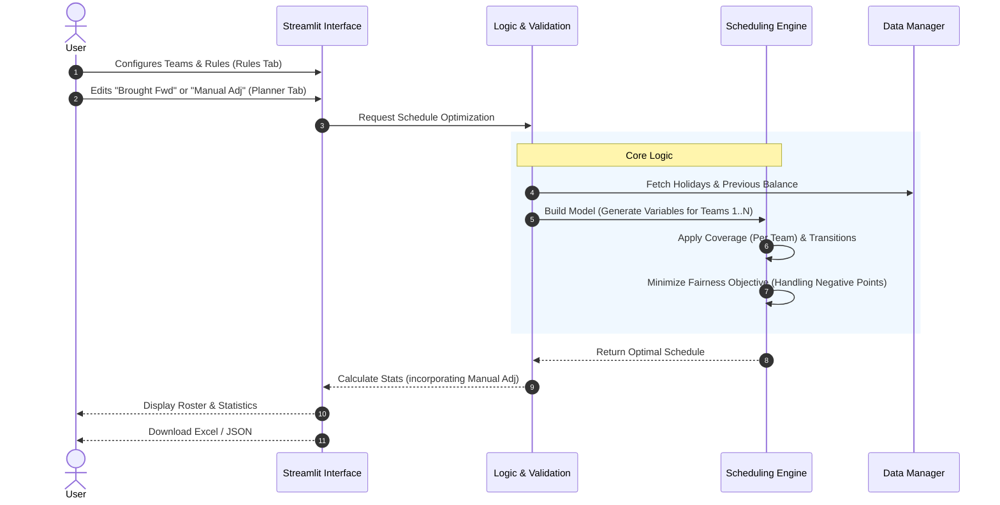

# Duty Planner

A Streamlit-based application for scheduling staff duties. This tool provides an interactive interface to plan rosters, configure constraints, and optimize schedules using Google's OR-Tools.

[](https://www.python.org/downloads/)

## Features

* **Interactive Planner:** Visual grid to manually assign or view duties.
* **Multi-Team Support:** Configure multiple Active (AM/PM/24H) and Standby teams. The system dynamically generates shift slots (e.g., `AM_2`, `S/B_2`) to match your operational scale.
* **Automated Scheduling:** Uses constraint programming (OR-Tools) to auto-fill the roster while respecting rules.
* **Fairness Optimization:** Balances workload across staff using a weighted point system. Supports **Negative Balances** to gracefully handle point debts or corrections.
* **Manual Adjustments:** Correct balances directly in the planner:
  * Edit **Brought Fwd** points to fix starting balances.
  * Apply **Manual Adj** (penalties/bonuses) for ad-hoc events.
* **Configurable Rules:**
  * **Dynamic Shift Transitions:** Configure "Hard Bans" (forbidden) or "Soft Bans" (discouraged) for shift pairs (e.g., AM $\to$ PM) via the UI.
  * **Catch-Up Limit:** Prevent overloading staff who are "catching up" on points by setting a relative cap on monthly workload.
* **Excel Export:** Download the final roster and statistics as an Excel file.
* **Secure Client-Side Storage:** Configurations are saved to your local machine as JSON, ensuring no personal data is stored on the server.

## Logic & Constraints

The solver balances two types of rules to create a schedule. It enforces specific transition rules between shifts on consecutive days and handles multiple independent teams.

### 1. Hard Constraints (Mandatory)
These rules **must** be met. If they cannot be satisfied, the solver will return "No Solution."
* **Team Coverage:** Every day must have the exact number of required staff *per team*.
  * *Example:* If "Active Teams" = 2 and "AM Staff" = 1, the solver ensures 2 people work AM shifts total (1 as `AM`, 1 as `AM_2`).
* **Fixed Assignments:** Any manual entry in the grid (e.g., a user manually assigned 'AM') is treated as locked.
* **Availability:** Staff marked as 'X' (Unavailable) cannot be assigned duties.
* **Physiological Limits:**
  * Max 1 shift per person per day.
  * **Transition Rules:** Any shift transition marked as "Hard Ban" in the Rules tab is strictly forbidden.
* **Catch-Up Limit (Relative Cap):**
  * If configured (> 0), no staff member can be assigned more than `Average Monthly Points + Limit`.
  * Setting this to **0** disables the cap (Unlimited Catch Up).

### 2. Soft Constraints (Optimization Targets)
These are rules the solver *tries* to follow but can break if necessary to find a solution. Breaking them incurs a "penalty."
* **Fairness:** The solver aims to minimize the difference in total points between the busiest and least busy staff member.
* **Soft Bans:** Transitions marked as "Soft Ban" in the Rules tab are discouraged. The solver will avoid them unless strictly necessary to meet Hard Constraints.

### 3. Multi-Team Logic
The application supports scaling operations via the **Rules** tab:
* **Active Teams:** Increases the number of operational lines (AM/PM/24H). Team 2 shifts are labeled `AM_2`, `PM_2`, etc.
* **Standby Teams:** Increases independent standby lines (e.g., `S/B`, `S/B_2`).
* **Point Inheritance:** Suffixed shifts (e.g., `24H_2`) automatically inherit the point values and multiplier rules (e.g., Public Holidays) of their base type (`24H`).

### 4. Shift Transition Permutations (Day N $\rightarrow$ Day N+1)
Transitions are fully configurable via the **Rules** tab. You can set any pair (e.g., AM $\to$ PM) to one of the following statuses:

| Status | Behavior |
| :--- | :--- |
| **Allowed** | ✅ Completely valid transition. |
| **Soft Ban** | ⚠️ Discouraged. Solver will avoid this if possible (incurs penalty). |
| **Hard Ban** | ⛔ Strictly forbidden. Solver will never assign this sequence. |

## Architecture

The application follows a Model-View-Controller (MVC) pattern adapted for Streamlit.



## Setup & Installation

1.  **Clone the repository:**
    ```bash
    git clone https://github.com/genes3e7/duty-planner.git
    cd duty-planner
    ```

1.  **Install dependencies:**
    ```bash
    uv sync
    ```

2.  **Run the application:**
    ```bash
    uv run streamlit run streamlit_app.py
    ```

## Testing Methodology

The project employs a comprehensive testing strategy:

* **Unit Tests (`tests/test_logic.py`, `tests/test_helpers.py`):**
  * *Methodology:* **Mocking & Isolation**. Tests pure functions like data parsing and string manipulation helper (e.g., `get_shift_name`).
* **Core Logic Tests (`tests/test_core_scheduler.py`):**
  * *Methodology:* **Constraint Verification**. Verifies mathematical correctness of the OR-Tools model against standard constraints.
* **Feature Tests (`tests/test_multi_team.py`, `tests/test_points_system.py`):**
  * *Methodology:* **Scenario-Based Testing**. Specifically targets new features like Multi-Team coverage, Negative Point domains, and Point Multipliers.
* **Integration Tests (`tests/test_app_integration.py`):**
  * *Methodology:* **Headless UI Testing**. Simulates user interaction with Streamlit components to ensure state updates correctly across pages.

## Deployment

Try out the live demo at:
[**smart-duty-scheduler.streamlit.app**](https://smart-duty-scheduler.streamlit.app/)
