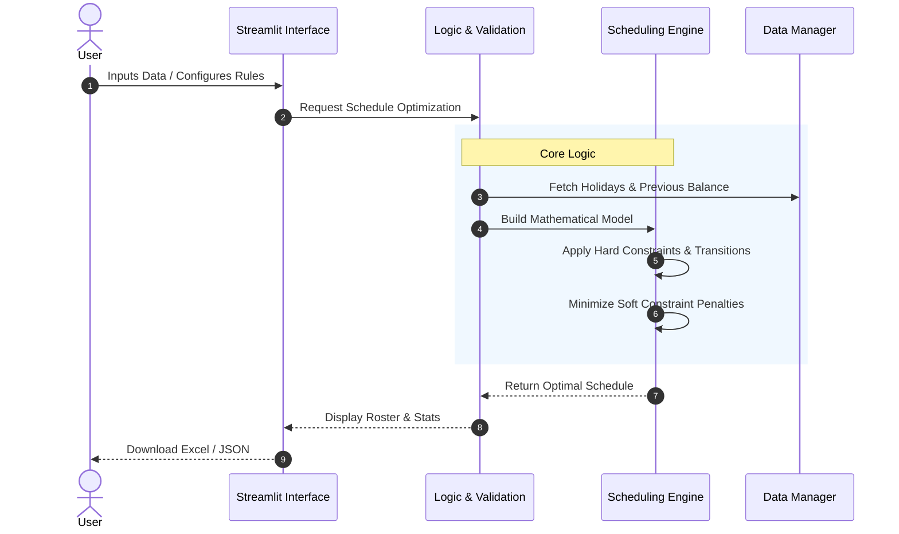

# Duty Planner

A Streamlit-based application for scheduling staff duties. This tool provides an interactive interface to plan rosters, configure constraints, and optimize schedules using Google's OR-Tools.

<!-- BADGES_START -->
[](https://www.python.org/downloads/)
<!-- BADGES_END -->

## Features

* **Interactive Planner:** Visual grid to manually assign or view duties.
* **Automated Scheduling:** Uses constraint programming (OR-Tools) to auto-fill the roster while respecting rules.
* **Fairness Optimization:** Attempts to balance points (workload) across all staff, considering carried-over balances.
* **Configurable Rules:**
  * Set daily manpower needs (AM, PM, 24H, Standby).
  * Define point values for different shifts.
  * Apply multipliers for weekends and public holidays.
* **Excel Export:** Download the final roster and statistics as an Excel file.
* **Secure Client-Side Storage:** Configurations are saved to your local machine as JSON, ensuring no personal data is stored on the server.

## Logic & Constraints

The solver balances two types of rules to create a schedule. It also strictly enforces specific transition rules between shifts on consecutive days.

### 1. Hard Constraints (Mandatory)
These rules **must** be met. If they cannot be satisfied, the solver will return "No Solution."
* **Coverage:** Every day must have the exact number of required staff (e.g., 1 AM, 1 PM).
* **Fixed Assignments:** Any manual entry in the grid (e.g., a user manually assigned 'AM') is treated as locked.
* **Availability:** Staff marked as 'X' (Unavailable) cannot be assigned duties.
* **Physiological Limits:**
    * Max 1 shift per person per day.
    * Specific "Hard Ban" transitions (see table below) are forbidden.

### 2. Soft Constraints (Optimization Targets)
These are rules the solver *tries* to follow but can break if necessary to find a solution. Breaking them incurs a "penalty."
* **Fairness:** The solver aims to minimize the difference in total points between the busiest and least busy staff member.
* **Soft Bans:** Specific "Soft Ban" transitions (see table below) are discouraged and penalized but allowed if no other option exists.

### 3. Shift Transition Permutations (Day N $\rightarrow$ Day N+1)
The following table defines exactly which shift transitions are allowed, penalized (Soft Ban), or forbidden (Hard Ban).

| Current Shift (Day N) | Next Shift (Day N+1) | Status | Notes |
| :--- | :--- | :--- | :--- |
| **AM** | **AM** | ✅ Allowed | |
| **AM** | **PM** | ⚠️ Soft Ban | Double shift split across days. |
| **AM** | **24H** | ✅ Allowed | |
| **AM** | **S/B** | ✅ Allowed | |
| **PM** | **AM** | ⛔ Hard Ban | Insufficient rest (<12h). |
| **PM** | **PM** | ⛔ Hard Ban | |
| **PM** | **24H** | ⛔ Hard Ban | Insufficient rest before 24H. |
| **PM** | **S/B** | ⚠️ Soft Ban | |
| **24H** | **AM** | ⛔ Hard Ban | Insufficient rest after 24H. |
| **24H** | **PM** | ✅ Allowed | |
| **24H** | **24H** | ⛔ Hard Ban | No consecutive 24H shifts. |
| **24H** | **S/B** | ⛔ Hard Ban | |
| **S/B** | **AM** | ⚠️ Soft Ban | |
| **S/B** | **PM** | ✅ Allowed | |
| **S/B** | **24H** | ⛔ Hard Ban | |
| **S/B** | **S/B** | ⚠️ Soft Ban | Consecutive standby discouraged. |
| **Empty** | **Any** | ✅ Allowed | |
| **Any** | **Empty** | ✅ Allowed | |
| **Empty** | **Empty** | ✅ Allowed | |

## Architecture

The application follows a Model-View-Controller (MVC) pattern adapted for Streamlit.



## Setup & Installation

1.  **Clone the repository:**
    ```bash
    git clone https://github.com/genes3e7/duty-planner.git
    cd duty-planner
    ```

2.  **Create a virtual environment (Recommended):**
    ```bash
    python -m venv .venv
    source .venv/bin/activate  # On Windows: .venv\Scripts\activate
    ```

3.  **Install dependencies:**
    ```bash
    pip install -r requirements.txt
    ```

4.  **Run the application:**
    ```bash
    streamlit run streamlit_app.py
    ```

## Testing Methodology

The project employs a comprehensive testing strategy:

* **Unit Tests (`tests/test_logic.py`, `tests/test_data.py`):**
    * *Methodology:* **Mocking & Isolation**. External dependencies (like File I/O) are mocked to test data parsing logic purely.
    * *Focus:* Input validation, data transformation, and correct handling of edge cases (e.g., invalid dates).
* **Core Logic Tests (`tests/test_core_scheduler.py`):**
    * *Methodology:* **Constraint Verification**. Sets up specific minimal scenarios to prove that hard constraints (like "No consecutive 24H shifts") actually prevent invalid solutions.
    * *Focus:* Mathematical correctness of the OR-Tools model against the Transition Permutations defined above.
* **Integration Tests (`tests/test_app_integration.py`):**
    * *Methodology:* **Headless UI Testing**. Uses `streamlit.testing` to simulate a user clicking buttons and changing settings to ensure the state updates correctly across the app.

## Deployment

Try out the live demo at:
[**smart-duty-scheduler.streamlit.app**](https://smart-duty-scheduler.streamlit.app/)
