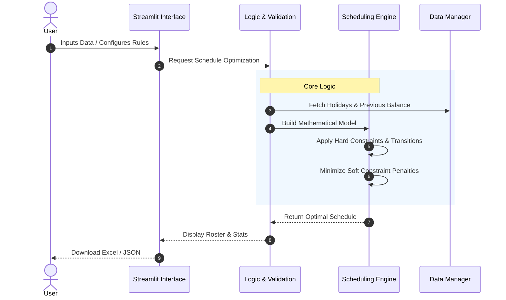

# Duty Planner

A Streamlit-based application for scheduling staff duties. This tool provides an interactive interface to plan rosters, configure constraints, and optimize schedules using Google's OR-Tools.

[](https://www.python.org/downloads/)
## Features

* **Interactive Planner:** Visual grid to manually assign or view duties.
* **Automated Scheduling:** Uses constraint programming (OR-Tools) to auto-fill the roster while respecting rules.
* **Fairness Optimization:** Attempts to balance points (workload) across all staff, considering carried-over balances.
* **Configurable Rules:**
  * **Dynamic Shift Transitions:** Configure "Hard Bans" (forbidden) or "Soft Bans" (discouraged) for shift pairs (e.g., AM $\to$ PM) via the UI.
  * **Catch Up Limit:** Prevent overloading staff who are "catching up" on points by setting a relative cap on monthly workload.
  * Set daily manpower needs (AM, PM, 24H, Standby).
  * Define point values and multipliers for Weekends/PH.
* **Excel Export:** Download the final roster and statistics as an Excel file.
* **Secure Client-Side Storage:** Configurations are saved to your local machine as JSON, ensuring no personal data is stored on the server.

## Logic & Constraints

The solver balances two types of rules to create a schedule. It also strictly enforces specific transition rules between shifts on consecutive days.

### 1. Hard Constraints (Mandatory)
These rules **must** be met. If they cannot be satisfied, the solver will return "No Solution."
* **Coverage:** Every day must have the exact number of required staff (e.g., 1 AM, 1 PM).
* **Fixed Assignments:** Any manual entry in the grid (e.g., a user manually assigned 'AM') is treated as locked.
* **Availability:** Staff marked as 'X' (Unavailable) cannot be assigned duties.
* **Physiological Limits:**
  * Max 1 shift per person per day.
  * **Transition Rules:** Any shift transition marked as "Hard Ban" in the Rules tab is strictly forbidden.
* **Catch Up Limit (Relative Cap):**
  * If configured (> 0), no staff member can be assigned more than `Average Monthly Points + Limit`.
  * *Example:* If the average workload is 15 points and the limit is 5, no one can exceed 20 points, even if they have a large point deficit.
  * Setting this to **0** disables the cap (Unlimited Catch Up).

### 2. Soft Constraints (Optimization Targets)
These are rules the solver *tries* to follow but can break if necessary to find a solution. Breaking them incurs a "penalty."
* **Fairness:** The solver aims to minimize the difference in total points between the busiest and least busy staff member.
* **Soft Bans:** Transitions marked as "Soft Ban" in the Rules tab are discouraged. The solver will avoid them unless strictly necessary to meet Hard Constraints.

### 3. Shift Transition Permutations (Day N $\rightarrow$ Day N+1)
Transitions are fully configurable via the **Rules** tab in the application. You can set any pair (e.g., AM $\to$ PM) to one of the following statuses:

| Status | Behavior |
| :--- | :--- |
| **Allowed** | ✅ Completely valid transition. |
| **Soft Ban** | ⚠️ Discouraged. Solver will avoid this if possible (incurs penalty). |
| **Hard Ban** | ⛔ Strictly forbidden. Solver will never assign this sequence. |

## Architecture

The application follows a Model-View-Controller (MVC) pattern adapted for Streamlit.



## Setup & Installation

1.  **Clone the repository:**
    ```bash
    git clone https://github.com/genes3e7/duty-planner.git
    cd duty-planner
    ```

2.  **Create a virtual environment (Recommended):**
    ```bash
    python -m venv .venv
    source .venv/bin/activate  # On Windows: .venv\Scripts\activate
    ```

3.  **Install dependencies:**
    ```bash
    pip install -r requirements.txt
    ```

4.  **Run the application:**
    ```bash
    streamlit run streamlit_app.py
    ```

## Testing Methodology

The project employs a comprehensive testing strategy:

* **Unit Tests (`tests/test_logic.py`, `tests/test_data.py`):**
  * *Methodology:* **Mocking & Isolation**. External dependencies (like File I/O) are mocked to test data parsing logic purely.
* **Core Logic Tests (`tests/test_core_scheduler.py`):**
  * *Methodology:* **Constraint Verification**. Verifies mathematical correctness of the OR-Tools model against standard constraints.
* **Feature Tests (`tests/test_catch_up_limit.py`, `tests/test_scheduling_rules.py`):**
  * *Methodology:* **Scenario-Based Testing**. Specifically targets new features like the Relative Catch Up Limit and Dynamic Rules Matrix to ensure edge cases (e.g., Limit=0) behave as expected.
* **Integration Tests (`tests/test_app_integration.py`):**
  * *Methodology:* **Headless UI Testing**. Simulates user interaction with Streamlit components to ensure state updates correctly.

## Deployment

Try out the live demo at:
[**smart-duty-scheduler.streamlit.app**](https://smart-duty-scheduler.streamlit.app/)
