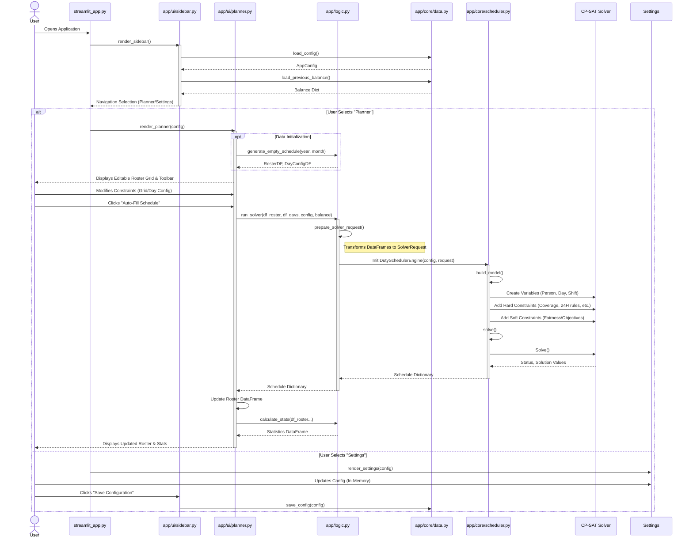

# Duty Planner

A Streamlit-based application for scheduling staff duties. This tool provides an interactive interface to plan rosters, configure constraints, and optimize schedules using Google's OR-Tools.

<!-- BADGES_START -->
[](https://www.python.org/downloads/)
<!-- BADGES_END -->

## Features

* **Interactive Planner:** Visual grid to manually assign or view duties.
* **Automated Scheduling:** Uses constraint programming (OR-Tools) to auto-fill the roster while respecting rules.
* **Fairness Optimization:** Attempts to balance points (workload) across all staff, considering carried-over balances.
* **Configurable Rules:**
  * Set daily manpower needs (AM, PM, 24H, Standby).
  * Define point values for different shifts.
  * Apply multipliers for weekends and public holidays.
* **Excel Export:** Download the final roster and statistics as an Excel file.

## Architecture

The application follows a Model-View-Controller (MVC) pattern adapted for Streamlit.



## Setup & Installation

1.  **Clone the repository:**
    ```bash
    git clone https://github.com/genes3e7/duty-planner.git
    cd duty-planner
    ```

2.  **Create a virtual environment (Recommended):**
    ```bash
    python -m venv .venv
    source .venv/bin/activate  # On Windows: .venv\Scripts\activate
    ```

3.  **Install dependencies:**
    ```bash
    pip install -r requirements.txt
    ```

4.  **Run the application:**
    ```bash
    streamlit run streamlit_app.py
    ```

## Configuration

The application settings are stored in `config.json` (created on first save). You can modify these via the **Settings** page in the UI or by editing the JSON file directly.

* **Personnel:** List of names.
* **Constraints:**
    * `personnel_needed_per_shift`: Dictionary defining needs (e.g., `{"AM": 1, "PM": 1}`).
    * `max_consecutive_duties`: Max days a person can work in a row.
* **Points:**
    * **Base Points:** How many points is a duty worth? (e.g., `24H = 2.0`, `AM = 1.0`).
    * **Multipliers:** Configure multipliers for Weekends, Public Holidays, etc.

## Development

* **Tests:** Run `pytest` to execute the test suite.
* **Linting:** Uses `ruff` for linting and formatting.
* **Dependency Management:** Uses `pip-tools` (`requirements.in`).
